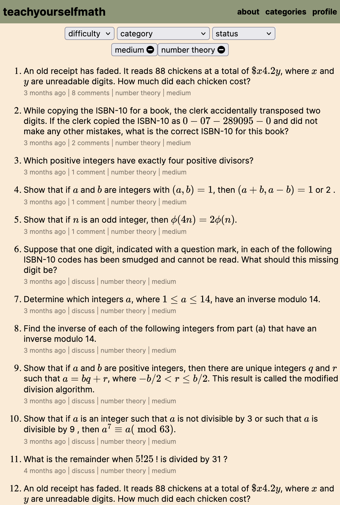

# teachyourselfmath

  

I wished for a free website with a large list of math problems, teachyourselfmath is that website.



### Description

If a document containing math problem exists, we'd like to extract every problem from it and dump it in a database. LaTeX is something that can be understood by both, computers and humans. Hence, the problem boils down to converting a PDF into LaTeX, removing the irrelevant parts, and storing the remaining parts.

When I started this project, I used [Meta's model](https://facebookresearch.github.io/nougat/) to parse academic PDF documents and find the LaTeX math in it. This approach was promising but the model is computationally expensive to run. Thankfully, LLMs have gotten much better at finding the contents of an image. If I could first convert the PDF into an image, LaTeX extraction would then be easier. And this is exactly what I am doing right now.

For a longer and less technical rant about this project - read [this](https://vivekn.dev/blog/teachyourselfmath).

### Setup

1. You will need PostgreSQL and Redis to run this.
2. `yarn`
3. `yarn build`
4. Setup the `.env` file using the `.env.example` file.
5. `yarn start`!

### [OPTIONAL DEPENDENCY] now experimenting with online issues for the math club:

Trying to figure out a pipeline driven by AI that generates raw markdown files like [this one](./src/web/md/ISSUE_001.md) and we run pandoc over it to get a file like [this one](./src/web/pdfs/ISSUE_001.pdf).

Prompts available at: [prompts.txt](./scripts/prompts.txt)

Sample also available at: [teachyourselfmath.app/issues/001](https://teachyourselfmath.app/issues/001)

Get pandoc from: https://pandoc.org/

On MacOS, we also need `pdflatex`:
```bash
brew install basictex
eval "$(/usr/libexec/path_helper)"
```

Generate stuff by:
```
pandoc src/web/md/ISSUE_001.md -o src/web/pdf/ISSUE_001.pdf
```

### Contributing

I am happy to accept pull requests. No hard rules.

### Acknowledgements

created by Vivek Nathani ([@viveknathani_](https://twitter.com/viveknathani_)), licensed under the [MIT License](./LICENSE).
