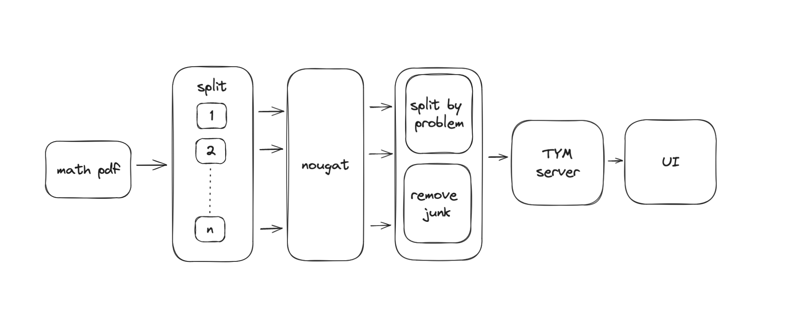

# teachyourselfmath

I wished for a free website with an ever-growing list of math problems, teachyourselfmath is that website.

### how does it work

If a document containing math problem exists, we'd like to extract every problem from it and dump it in a database. LaTeX is something that can be understood by both, computers and humans. Hence, the problem boils down to converting a PDF into LaTeX, removing the irrelevant parts, and storing the remaining parts. 

Meta came up with a [model](https://facebookresearch.github.io/nougat/) to parse academic PDF documents and find the LaTeX math in it.

Currently, I run this model's server locally on my computer with every PDF I can get my hands on. The main server has a queue based system that interacts with the model's server and process all the problems. Here is a visual illustration of how it works:

### setup

1. Get `nougat` from [here](https://github.com/facebookresearch/nougat). Run it as a server.
2. You will need PostgreSQL and Redis to run this.
2. `yarn`
3. `yarn build`
4. Setup the `.env` file using the `.env.example` file.
5. `yarn start`!

### acknowledgements

created by Vivek Nathani ([@viveknathani_](https://twitter.com/viveknathani_)), licensed under the [MIT License](./LICENSE).